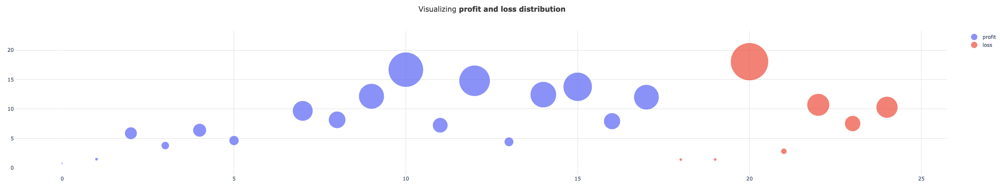
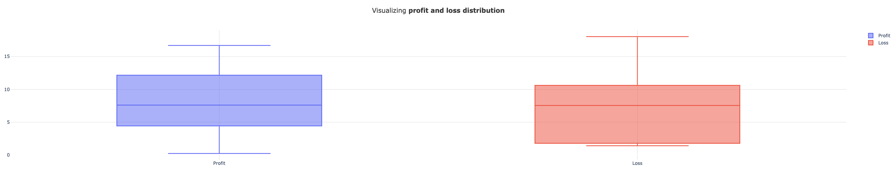
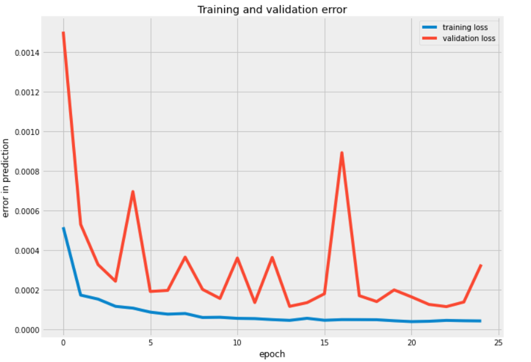
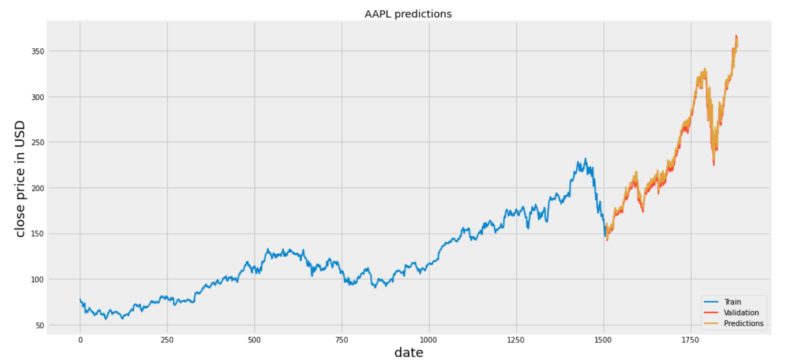

# Quant-Trading

## Introduction 
The following project is an ongoing developmental work for deep learning based algorithmic trading bot. The goal is to backtest stratergies after every trading session and tune learning parameters in order to maximize profit. The first approach to algorothmic trading is done using the implementation of technical indicators in trading

### MACD Indicator Stratergy 
The MACD Indicator is a popular indicator in the field of technical trading. Buying and Selling signals are generated based on exponential moving average crossovers — ie. the signal line and the MACD line crossover. In the implementation, <b>AAPL</b> has been backtested on this stratergy

#### Algorithm - 

• Sell at an anticipation of a bearish momentum: When MACD Line in the higher time frame crosses the signal line from above at an intersection > $0. </br>
• Buy at an anticipation of a bullish momentum: When MACD Line in the higher time frame crosses the signal line from below at an intersection < $0. </br>

#### Getting started -
Download the dependenies required to run the jupyter notebook using 
```
pip install -r macd_requirements.txt
```

Then run the jupyter notebook MACD.ipynb

#### Results - 
• <i>Initial investment</i> - $18.86 AAPL Stock </br>
• <i>Trading Time</i> - June 03, 2009 - June 03, 2019 </br>
• <i>Profit</i> - $90 </br>
• <i>Position</i> - 1 share AAPL </br>
• <i>Number of trades</i> - 25 </br>
• <i>Number of non-profitable trades</i> - 7 (28%) </br>
• <i>Number of profitable trades</i> - 18 (72%) </br>

</br></br>


#### Summary - 
• The losses, compared to the profits, were significantly less.</br>
• The interquartile range for the losses was less as compared to the profits on the AAPL stock.

### LSTM Stock Price Predicition

Long Short term networks are very useful when dealing with sequential data. They are useful in particular when dealing with long term memory connections — they solve the problem of vanishing gradients. In this program, we train the recurrent neural network on a 60 day window and predict the price of the AAPL stock following the 60th day.


#### Dataset 
The dataset was generated using pandas.data_reader. The data consisted of AAPL close price from 2013-01-01 to 2020-06-26.

#### Getting started -
Download the dependenies required to run the jupyter notebook using 
```
pip install -r prediction_requirements.txt
```

Then run the jupyter notebook stock_prices_prediction.ipynb

#### Results - 
The Neural Network was able to predict stock prices with an overall <b>testing RSME error of 3.59 </b> </br></br>



#### Summary - 
The network performed well when predicting the trend of the stock. However, more features like attention mechanisms can make the model more accurate.

## Goals Ahead 
• Add Q-Learning algorithm 
• Add RSI, Dual moving crossover stratergy


